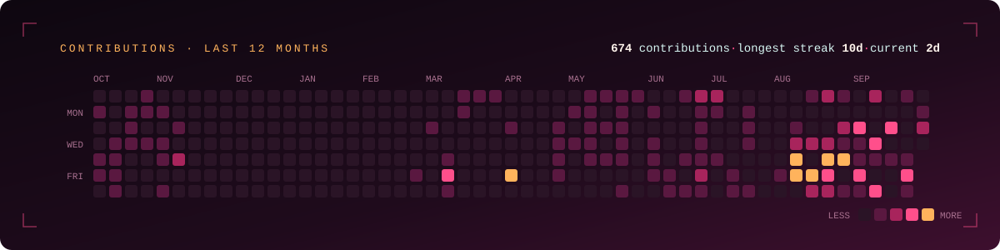

## About Me
Full-stack developer and computer science student. I work alone, which means I own every
layer: schema, server, interface, deployment, and the 3 a.m. incident.

**Selected work**
| Project | Description | Stack |
|---|---|---|
| Fable Kitchen OS *(private)* | Kitchen and operations management for a restaurant, in production | Laravel, MariaDB, Docker |
| [Inventory & Sales System](https://github.com/elosainta/inventory-sales-management-system) | Inventory, production and costing with LLM-assisted invoice scanning | Laravel, Tailwind, Claude API |
| Bukku Integration *(private)* | Telegram bot and MCP server linking operations to accounting | Python, httpx, systemd |

## Socials
    

## Tech Stack
                                 
## GitHub Stats

  
  

